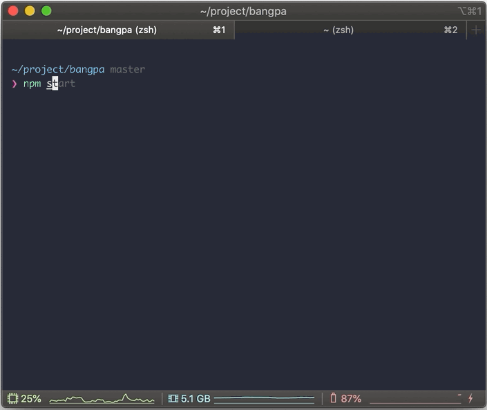
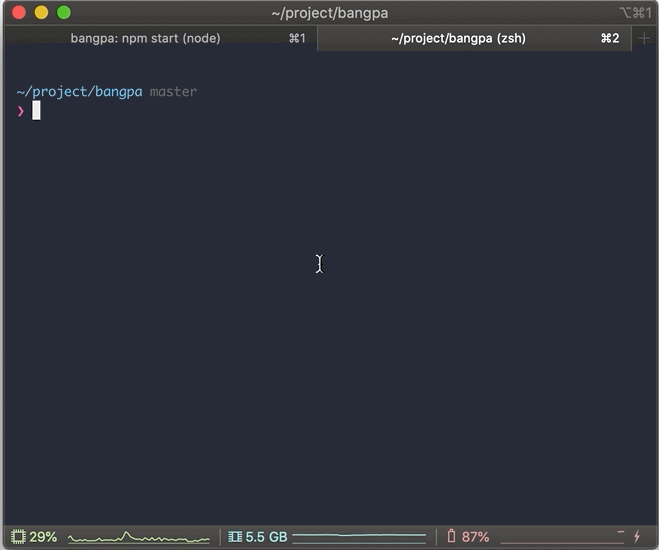

# bangpa 

## 📖 How to Use

### 💾 Installation

Clone source code from github and install node modules

```bash
git clone https://github.com/snowjang24/bangpa.git
cd bangpa
npm install
```

### 🏃‍♂️ Execution

After installation execute two cmd or terminal window and execute each execution code

#### For React.js Execution

Execute react on http://localhost:3000/, listen on 3000 port you can also change port whatever you wants

```bash
npm start
```



#### For Node.js Execution

Execute node on http://localhost:1024/, listen on 1024 port you can also change port whatever you wants

```bash
node server.js
```



### After Execution

After Installation and Execution phase, you can access to our Bangpa service at http://localhost:3000/

## Enjoy Bangpa Service! 👋


